# Widget Elements
## 1. Icon 
- Example code: ``./Tutorial_Templates/IconExample``
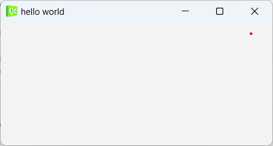
``` Cpp
setWindowIcon(QIcon(":/Images/qt.png"));
```
## 2. Label
- Label có chức năng hiển thị text, hình ảnh, ảnh động(GIF). Label trong thư viên QLabel
- Example Code: ``.\Tutorial_Templates\002_Label_Example``
- Hiển thị Text 
```Cpp
QLabel *label = new QLabel(this);
label->setText("This is the text");
label->setFont(QFont("Sanserif", 14));
label->setGeometry(100,100, 120,300);
label->setStyleSheet("color:red");
```
- Hiển thị hình ảnh
``` Cpp
QLabel *label = new QLabel(this);
label->setPixmap(QPixmap(":/Images/Images.png"));
```
- Hiển thị ảnh động (GIF)
``` Cpp
QLabel *label = new QLabel(this);
QMovie *movie = new QMovie(":/Images/GIF.gif"); 
label->setMovie(movie);
movie->start();
```
## 3. Button
- Example code: ``.\Tutorial_Templates\003_PushButtonExample``
``` Cpp
QPushButton *btn = new QPushButton(this);
btn->setText("Click");
btn->setGeometry(0,100, 100,100);
btn->setFont(QFont("Times", 15));
btn->setIcon(QIcon(":/images/qt.png"));
btn->setIconSize(QSize(36,36));
```
## Line Edit
## 4. Layout
### i.Căn chỉnh layout theo chiều ngang
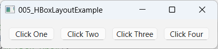 \
- Example code: ``.\Tutorial_Templates\005_HBoxLayoutExample`` 
``` Cpp
QHBoxLayout *hbox = new QHBoxLayout(this);
hbox->addWidget(btn1);
hbox->addWidget(btn2);
hbox->addWidget(btn3);
hbox->addWidget(btn4);
hbox->addSpacing(0);
```
### ii.Căn chỉnh layout theo chiều dọc 
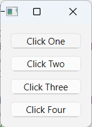
- Example code: ``.\Tutorial_Templates\006_VBoxLayoutExample``
``` Cpp
QVBoxLayout *vbox = new QVBoxLayout(this);
vbox->addWidget(btn1);
vbox->addWidget(btn2);
vbox->addWidget(btn3);
vbox->addWidget(btn4);
```

### iii. Căn chỉnh layout theo dạng lưới 
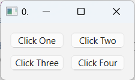
- Example code: ``.\Tutorial_Templates\007_GridLayoutExample``
``` Cpp
QGridLayout *grid = new QGridLayout(this);
grid->addWidget(btn1, 0, 0);
grid->addWidget(btn2, 0,1);
grid->addWidget(btn3, 1,0);
grid->addWidget(btn4, 1,1);
```
## 5. Radio Button
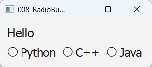
- Example code: 
```Cpp
QRadioButton *rad1 = new QRadioButton();
rad1->setText("radion Button");
rad1->setFont(QFont("Times", 14));
rad1->setIcon(QIcon(":/images/icon.png"));
rad1->setIconSize(QSize(40,40));
``` 

## 6. Signals Slots
<!--  -->
``` Cpp

```
## 7. CheckBox
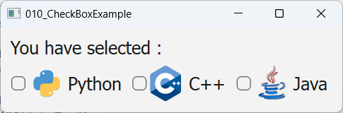
- Example code: 
``` Cpp
QCheckBox *check1 = new QCheckBox();
check1->setText("CheckBox");
check1->setFont(QFont("Times", 15));
check1->setIcon(QIcon(":/images/icon.png"));
check1->setIconSize(QSize(40,40));
```
## 8. SpinBox
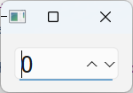
- Example code: ``.\Tutorial_Templates\011_SpinBoxExample``
``` Cpp
QSpinBox *spinBox = new QSpinBox();
spinBox->setFont(QFont("Times", 15));
```
## 9. LCD Number
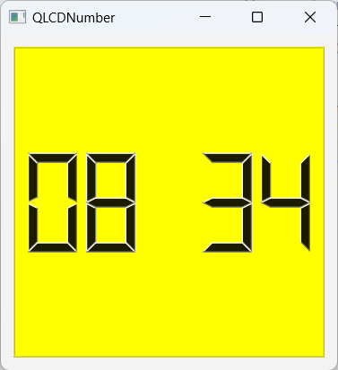
- Example code: ``.\Tutorial_Templates\012_LCDNumberExample``
``` Cpp
QLCDNumber *lcd = new QLCDNumber();
lcd->display("Num");
```
## 10. Combo 
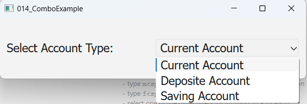
- Example code: ``.\Tutorial_Templates\014_ComboExample``
``` Cpp
QComboBox *combo = new QComboBox();
combo->setFont(QFont("Times", 14));
combo->addItem("Item1");
combo->addItem("Item2");
combo->addItem("Item3");
```
## 11. Slider
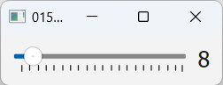
- Example code: ``.\Tutorial_Templates\015_SliderExample``
```  Cpp
QSlider *slider = new QSlider();
slider->setOrientation(Qt::Horizontal);
slider->setTickPosition(QSlider::TicksBelow);
slider->setTickInterval(5);
slider->setMinimum(1);
slider->setMaximum(100);
```
## 12. ListWidget
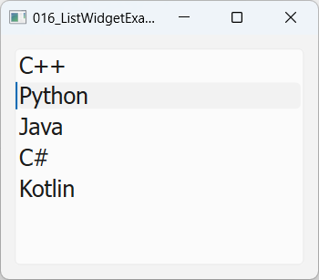
- Example code: ``.\Tutorial_Templates\016_ListWidgetExample``
``` Cpp
QListWidget *listWidget = new QListWidget();
listWidget->setFont(QFont("Times", 15));
listWidget->contentsMargins();
listWidget->insertItem(0, "Item1");
listWidget->insertItem(1, "Item2");
listWidget->insertItem(2, "Item3");
```
## 13. TableWidget
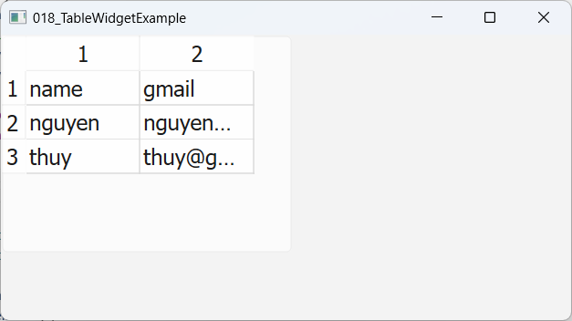
- Example code: ``.\Tutorial_Templates\018_TableWidgetExample``
```Cpp
QTableWidget *table = new QTableWidget(this);
table->setFont(QFont("Sanserif", 14));
table->setRowCount(row_nums); // số hàng
table->setColumnCount(column_nums); // số cột

QTableWidgetItem *Item00 = new QTableWidgetItem;
name->setText("Item00");
QTableWidgetItem *Item01 = new QTableWidgetItem;
email->setText("Item01");

table->setItem(0,0, Item00);
table->setItem(0,1, Item01);
```
## 14. Color Dialog
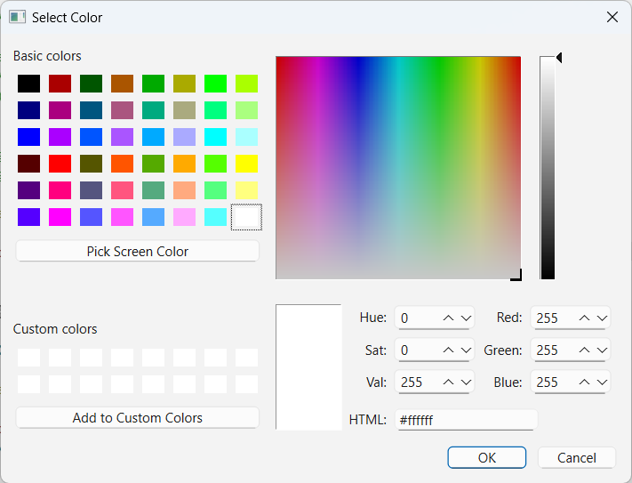
- Example code: ``.\Tutorial_Templates\021_ColorDialog``
``` Cpp
QColorDialog *colorDialog = new QColorDialog();
QColor color = colorDialog->getColor(); // nhận giá trị color từ colorDialog
```
## 15. Forn Dialog
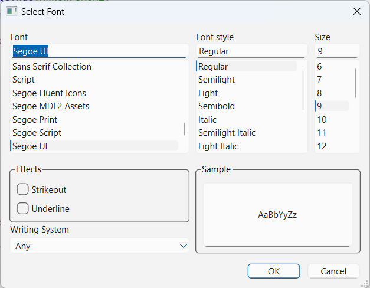
- Example code: ``.\Tutorial_Templates\022_FontDialog``
``` Cpp
bool ok;
QFont font = QFontDialog::getFont(&ok, this);
if(ok) 
{
    textEdit->setFont(font);
}
```
## 16. Input Dialog
- Text
``` Cpp
bool ok;
QString text = QInputDialog::getText(this, "Input Dialog", "Enter your Text",QLineEdit::Normal,"",&ok);s
if (ok && !text.isEmpty()) {
qDebug() << "User entered:" << text;
}
```
- Int input
``` Cpp
int value = QInputDialog::getInt(
this,
"Input Dialog",
"Enter an integer:",
10, // Default value
0, // Minimum value
100, // Maximum value
1, // Step size
&ok
);
if (ok) {
qDebug() << "User entered integer:" << value;
}
```
- Double input
``` Cpp
double value = QInputDialog::getDouble(this, "Input Dialog", "Enter a double:",
10.5, // Default value
0.0, // Minimum value
100.0, // Maximum value
2, // Decimal precision
&ok
);
if (ok) {
qDebug() << "User entered double:" << value;
}
```
- Items Selection
``` Cpp
QStringList items = {"Red", "Blue", "Green"};
QString item = QInputDialog::getItem(this,"Input Dialog","Select a color:",items,
0, // Default index
false, // Editable or not
&ok
);
if (ok && !item.isEmpty()) {
qDebug() << "User selected:" << item;
}
```
## 16. MessageBox
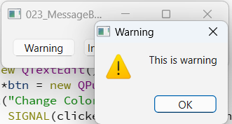
- Example code: ``.\Tutorial_Templates\023_MessageBox``
``` Cpps
QMessageBox *msg = new QMessageBox();
msg->setText("Delete Items");
msg->setInformativeText("Do you want to delete all items ? ");
msg->setStandardButtons(QMessageBox::Yes | QMessageBox::Discard | QMessageBox::Cancel);
```
``` Cpp
QMessageBox::warning(this, "Warning", "This is warning");
QMessageBox::information(this, "information", "This is information");
QMessageBox::about(this, "about", "This is about");
```


## Designer UI


# B. Qt Quick(QML)
## 1. Tạo hình chữ nhật
``` QML
Rectangle {
    id:rect3
    x:200;y:200
    width:176;height:96
    gradient: Gradient {
        GradientStop {position: 0.0; color:"lightsteelblue"}
        GradientStop {position: 1.0; color:"slategray"}

    }

    border.color: "slategray"
}
```
## 2. Text
``` QML
Text {
    text:"Welcome to Qt6 Course"
    x:50;y:50
    color:"red"
    font.family: "Times"
    font.pixelSize: 28
}
```
## 3. Image
``` QML
Image {
    x:20;y:20
    width:200
    height:100
    source:"qrc:image/qml.png"
}
```
## 4. Mouse Area
```QML
Rectangle {
    id:rect1
    x:12;y:12
    width:76;height:96
    color:"red"

    MouseArea {
        id:area
        width: parent.width
        height:parent.height
        onClicked: rect2.visible = !rect2.visible


    }
}
```
<!-- ## III. Mobile APP -->