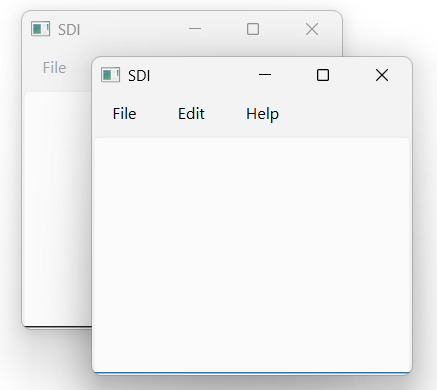
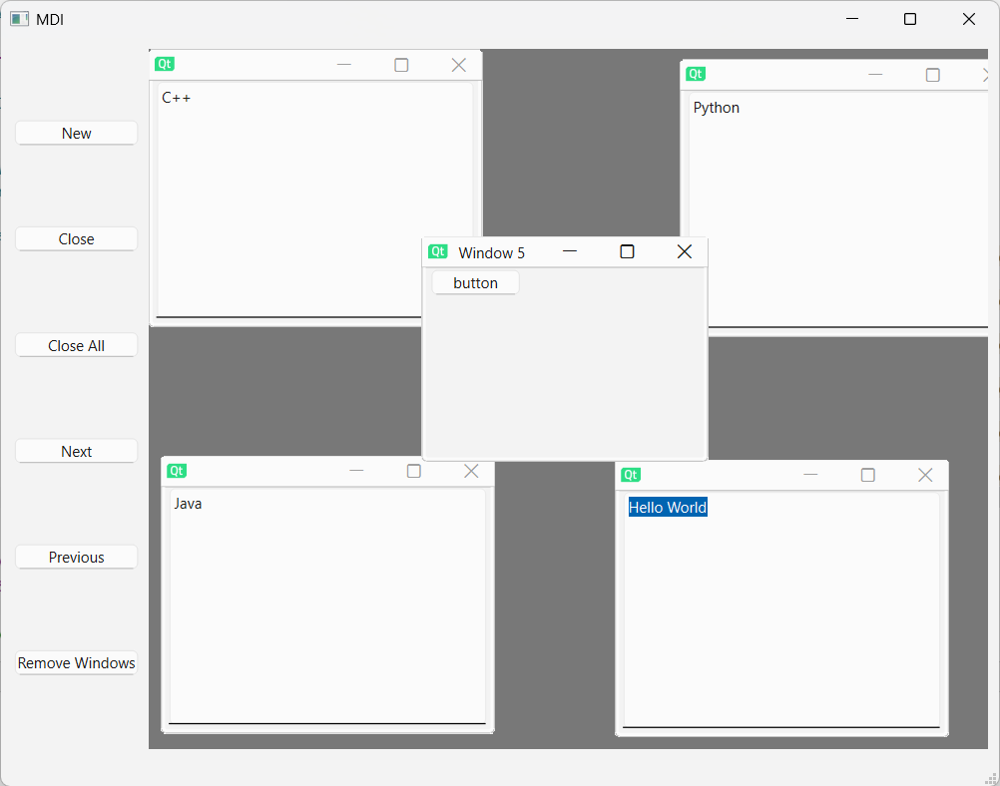
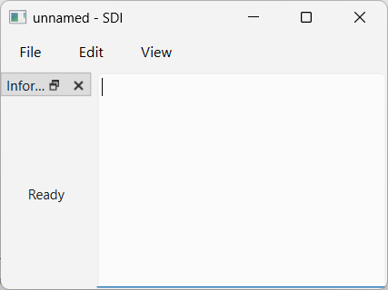

# SDI and MDI Windows
## I. SDI - Single Document Interface
### 1. Giới thiệu chung

- SDI được định nghĩa: Ứng dụng chỉ làm việc với một tài liệu (document) tại một thời điểm.
- Mỗi tài liệu mới sẽ được mở trong một cửa sổ riêng biệt của ứng dụng. Các cửa sổ này chạy song song với nhau
- Trong Qt: thường dùng QMainWindow, và mỗi tài liệu tương ứng với một instance của cửa sổ chính

## II. MDI - Multiple Document Interface
### 1. Giới thiệu chung

- MDI được dịnh nghĩa: Ứng dụng cho phép làm việc với nhiều tài liệu trong cùng một cửa sổ chính.
- Các tài liệu được mở trong các cửa sổ con (subwindow) nằm trong một "workspace" chung.
- Trong Qt: sử dụng QMdiArea để quản lý các cửa sổ con (QMdiSubWindow). QMdiArea nằm trong QMainWindow như một central widget.

Khi mở tài liệu mới, ta tạo một QMdiSubWindow và gắn widget vào đó.
### 2. SDI Dock
- Dock là các cửa sổ con có thể gắn (dock) vào cửa sổ chính hoặc thả nổi (float) tự do.
- Trong Qt, lớp này chính là QDockWidget.

